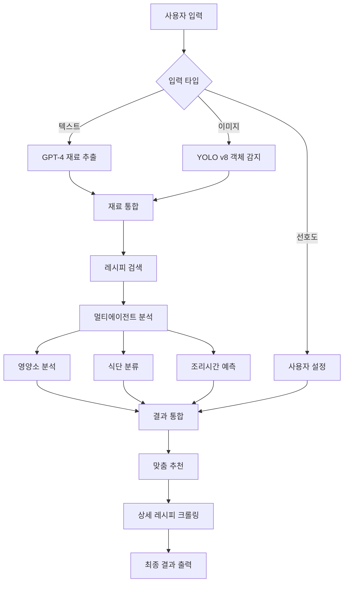

# 🍽️ AI 냉장고 요리사

> **냉장고 속 식재료로 AI가 맞춤 레시피를 추천해주는 똑똑한 요리사**


## 📹 시연 동영상

> **🎬 시연 영상이 여기에 들어갑니다**
> 
> *시연 영상 링크: [🍽️ AI 맞춤 레시피 추천 시연](https://drive.google.com/file/d/16sKL3d7V4t_BGLQxdvJmwy0tUvJQD-ud/view?usp=sharing)*

---

## 🎯 프로젝트 개요

사용자가 자연어를 입력하거나 식재료의 이미지를 첨부하면, AI가 이를 해석하여 재료명을 추출하고 사용자의 선호도를 고려하여 맞춤 레시피를 추천해주는 서비스입니다.

### ✨ 주요 특징

- 🤖 **AI 기반 재료 인식**: 텍스트와 이미지에서 식재료 자동 추출
- 🎭 **멀티에이전트 시스템**: 전문화된 AI 에이전트들의 협업
- 🍎 **영양소 분석**: 식단 유형별 맞춤 분류 (다이어트/케토/저염/채식)
- ⏰ **조리시간 예측**: AI 모델 기반 정확한 시간 예측
- 🎯 **개인화 추천**: 사용자 선호도 반영한 맞춤 레시피

---

## 🛠️ 기술 스택

### Backend


### AI & ML


### Frontend


### Tools & Collaboration


---

## 🏗️ 시스템 아키텍처



### 🤖 멀티에이전트 시스템

- **CoordinatorAgent**: 전체 워크플로우 조율
- **DataManagerAgent**: 영양소 데이터베이스 관리
- **IngredientMatchingAgent**: AI 기반 재료 매칭
- **UnitConversionAgent**: 단위 변환 처리
- **NutritionCalculatorAgent**: 영양소 계산
- **RecipeClassificationAgent**: 식단 유형 분류

---

## 🚀 설치 및 실행

### 📋 시스템 요구사항

- Python 3.8+
- OpenAI API Key
- 4GB+ RAM 권장

### 📦 설치

```bash
# 저장소 클론
git clone https://github.com/Eraser4869/SK_module_project_1.git
cd SK_module_project_1

# 필수 라이브러리 설치
pip install -r requirements.txt
```

### ⚙️ 환경 설정

`.env` 파일을 생성하고 다음 내용을 추가하세요:

```env
OPENAI_API_KEY=your_openai_api_key_here
MODEL_PATH=path/to/yolo/model.pt
```

### ▶️ 실행

```bash
streamlit run Interface.py
```


---

## 📖 사용법

### 1️⃣ **선호도 설정**
- **식단 유형**: 다이어트, 저탄고지, 저염, 채식 (복수 선택 가능)
- **조리시간**: 15분/30분/45분 이내 (단일 선택)
- **조리난이도**: 쉬움/보통/어려움 (단일 선택)

### 2️⃣ **재료 입력**
- **텍스트**: "토마토 200g, 양파 1개, 마늘 3쪽" 형태로 입력
- **이미지**: PNG, JPG, JPEG 형식 업로드

### 3️⃣ **추천 받기**
- "맞춤 레시피 추천받기" 버튼 클릭
- AI가 자동으로 재료 분석 → 레시피 검색 → 최적 추천 선택
- 선호도 매칭률과 상세 조리법 확인

---

## 👥 팀 구성

| 역할 | 이름 | 담당 업무 |
|------|------|-----------|
| **팀장** | 이지후 | 전체 시스템 아키텍처 설계, 데이터 통합 처리, 백엔드 개발 |
| **팀원** | 박진형 | 레시피 재료 파싱, 자동 보완형 추천 시스템, Open API 활용 |
| **팀원** | 손민성 | Streamlit 기반 사용자 인터페이스, 웹 UI 요소 개발 |
| **팀원** | 양윤지 | GPT 기반 사용자 입력 식재료 추출 기능 |
| **팀원** | 조영규 | 이미지 기반 식재료 인식 모델 (YOLO v8) |
| **팀원** | 추시현 | 사용자 옵션 선택, 세션 관리, 웹 프론트엔드 UI/UX |
| **팀원** | 한민주 | 조리시간 예측 모델, 웹 크롤링 기반 조리법 수집 |

---

## 📁 프로젝트 구조

```
SK_module_project_1/
├── 📄 Interface.py                          # Streamlit 웹 인터페이스
├── 🤖 ai_classifier_multi_agent.py         # 멀티에이전트 시스템
├── 🔗 recipe_data_integrator.py            # 데이터 통합 모듈
├── 🎯 recipe_recommend.py                   # 추천 엔진
├── ⏰ cooking_time_model.py                 # 조리시간 예측 모델
├── 🕷️ crawling.py                          # 레시피 크롤링
├── 💬 GPTAPI.py                            # GPT 재료 추출
├── 📷 food_ingredients_detect_module.py    # 이미지 기반 재료 인식
├── 🔍 run_recommendation.py                # 레시피 검색 및 추천
├── 🛠️ ingredient_utils.py                  # 재료 파싱 유틸리티
├── 📊 데이터/
│   ├── RECIPE_SEARCH.csv                   # 레시피 원천 데이터
│   ├── recipes.csv                         # 처리된 레시피 데이터
│   └── 전처리_국가표준식품성분표.csv       # 영양소 데이터
└── 🤖 모델/
    ├── cooking_time_model.pkl              # 학습된 조리시간 예측 모델
    ├── feature_columns.pkl                 # 모델 피처 정보
    └── best.pt                             # YOLO v8 모델 가중치
```

---

## 🎯 주요 기능

### 🔍 **지능형 재료 인식**
- **텍스트 처리**: GPT-4를 활용한 자연어 재료 추출
- **이미지 처리**: YOLO v8 + OpenAI Vision API 조합으로 높은 정확도

### 🧠 **AI 기반 영양 분석**
- **식단 분류**: 다이어트, 케토, 저염, 채식 자동 분류
- **영양소 계산**: 국가표준식품성분표 기반 정확한 영양 정보
- **재료 매칭**: 한국어 특화 임베딩 모델 (ko-sbert-nli) 활용

### ⚡ **실시간 추천**
- **선호도 점수**: 최대 100점 기준 맞춤 점수 계산
- **조리시간 예측**: Random Forest 모델 기반 정확한 시간 예측
- **상세 레시피**: 10000recipe 실시간 크롤링

---

## 📈 성능 지표

| 지표 | 성능 |
|------|------|
| 재료 매칭 정확도 | 80-90% |
| 전체 처리 시간 | 10-30초 |
| 지원 식재료 | 500+ 종류 |
| 레시피 데이터베이스 | 10,000+ 레시피 |

---


<div align="center">

**🍽️ 냉장고 속 재료로 만드는 맛있는 요리의 시작! 🍽️**

Made with ❤️ by Team 냉장고 나라 코코몽

</div>
